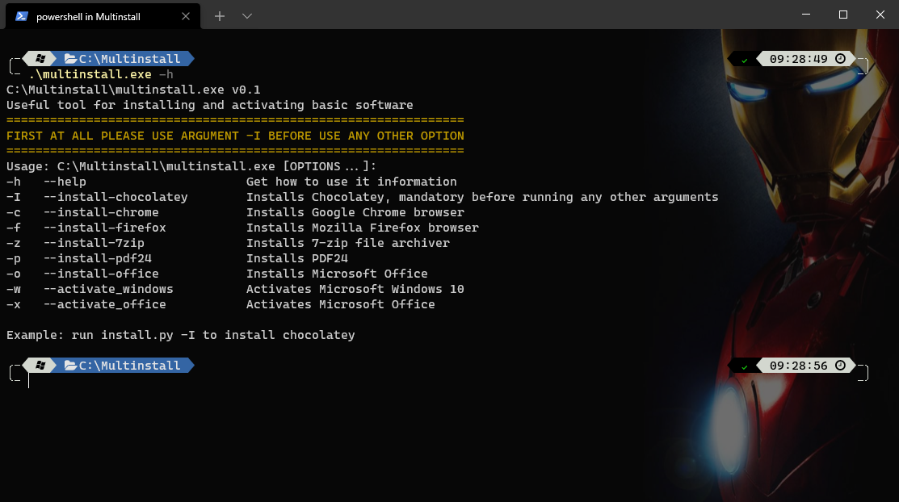

# Index
* [Español](https://github.com/Audrum/windows_activators#espa%C3%B1ol)
    * [Descripción](https://github.com/Audrum/windows_activators#descripci%C3%B3n)
    * [Instrucciones de uso](https://github.com/Audrum/windows_activators#instrucciones-de-uso)
    * [Descargas](https://github.com/Audrum/windows_activators#descargas)

* [English](https://github.com/Audrum/windows_activators#english)
    * [Description](https://github.com/Audrum/windows_activators#description)
    * [How to use it](https://github.com/Audrum/windows_activators#how-to-use-it)
    * [Downloads](https://github.com/Audrum/windows_activators#downloads)

---

# Español

## Descripción

Este es un proyecto de código abierto escrito en [Python](https://www.python.org) para facilitar algunas tareas post-formateo de una máquina Windows. Si tiene alguna duda, comentario o aporte, puede contactarme a través de [Telegram](https://telegram.org) buscándome como [@audrum](https://t.me/audrum).


# Instrucciones de uso

Solo debe descargarlo y ejecutarlo, después abrir una ventana de PowerShell **CON DERECHOS DE ADMINISTRADOR** ubicarse en la ruta **C:\Multinstall** usando el comando _**cd**_ e invocarlo con el parámetro _**-h**_ para ver la ayuda y las diferentes opciones:

```PowerShell
cd C:\Multinstall
.\multinstall.exe -h
```



## ¡Importante!

Después de obtener la ayuda, es necesario ejecutar el argumento _**-I**_ para instalar [Chocolatey](https://chocolatey.org/) ya que todas las demás acciones harán uso de este software.

```PowerShell
.\Multinstall.exe -I
```

## Opciones

Como se detalla en el menú de ayuda las diferentes opciones disponibles son:

| Argumento corto | Argumento largo | Descripción |
|:---------------:|:---------------:|:-----------:|
| -h | --help | Muestra la ayuda de uso |
| -I | --install-chocolatey | Instala Chocolatey, obligatorio antes de usar cualquier otra opción |
| -c| --install-chrome | Instala el navegador Google Chrome |
| -f | --install-firefox | Instala el navegador Mozilla Firefox |
| -z | --install-7zip | Instala 7-zip |
| -p | --install-pdf24 | Instala PDF24 |
| -o | --install-office | Instala Microsoft Office |
| -w | --activate-windows | Activa Microsoft Windows 10 |
| -x | --activate-office | Activa Microsoft Office |

## Descargas

Las descargas se encuentran en la sección de [_Releases_](https://github.com/Audrum/windows_activators/releases) o puede seleccionar el archivo a continuación:

* [Multinstall.exe](https://github.com/Audrum/windows_activators/releases/download/Multinstallv0.1/multinstall.sfx.exe)
* [Multinstall.py](https://github.com/Audrum/windows_activators/releases/download/Multinstallv0.1/multinstall.py)

## Desinstalar o elimniar

Para desinstalar o eliminar el software, simplemente se debe eliminar la carpeta __Multinstall__ ubicada en **C:/**.

---

# English

## Description

This is an open source project written in [Python](https://www.python.org) to make easier the post-installation process in Windows machines. If you have any doubt, comment or contribution, you can contact me through [Telegram](https://telegram.org) by my username [@audrum](https://t.me/audrum).

# How to use it

Just donwload it and install, then open a PowerShell temrinal **WITH ADMIN RIGHTS** and move to path **C:\Multinstall** with _**cd**_ command and you will be able to run **multinstall.exe** with the argument _**-h**_ to get help information and its different options.

```PowerShell
cd C:\Multinstall
.\multinstall.exe -h
```


## Important!

Once you have used the help argument, it is necesary to use the argument _**-I**_ in order to install [Chocolatey](https://chocolatey.org/) due to all the other options will use this software.

```PowerShell
.\Multinstall.exe -I
```

## Options

The different options available to use are:

| Short argument | Long argument | Description |
|:---------------:|:---------------:|:-----------:|
| -h | --help | Get how to use it information |
| -I | --install-chocolatey | Installs Chocolatey, mandatory before running any other arguments |
| -c| --install-chrome | Installs Google Chrome browser |
| -f | --install-firefox | Installs Mozilla Firefox browser |
| -z | --install-7zip | Installs 7-zip file archiver |
| -p | --install-pdf24 | Installs PDF24 |
| -o | --install-office | Installs Microsoft Office |
| -w | --activate-windows | Activates Microsoft Windows 10 |
| -x | --activate-office | Activates Microsoft Office |

## Downloads

You can download the files from the [_Releases_](https://github.com/Audrum/windows_activators/releases) section or select the file below:

* [Multinstall.exe](https://github.com/Audrum/windows_activators/releases/download/v0.1en/Multinstall.exe)
* [Multinstall.py](https://github.com/Audrum/windows_activators/releases/download/v0.1en/Multinstall.py)

## Unistall or delete

For deleting or unistalling the software, just delete the entire folder **Multinstall** from **C:/**.