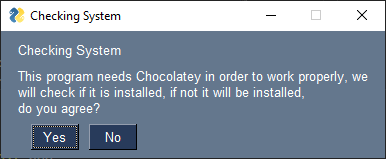
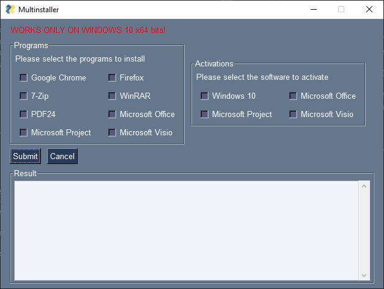
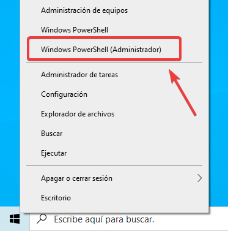
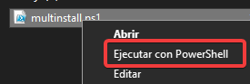
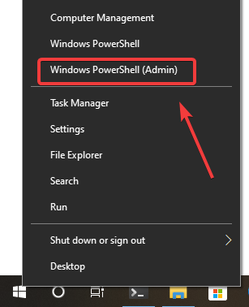
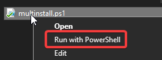

# Index
* [Español](https://github.com/Audrum/windows_activators#espa%C3%B1ol)
    * [Descripción](https://github.com/Audrum/windows_activators#descripci%C3%B3n)
    * [Instrucciones de uso versión gráfica]()
    * [Instrucciones de uso para el script en PowerShell](https://github.com/Audrum/windows_activators#instrucciones-de-uso-para-el-script-en-powershell)
    * [Descargas](https://github.com/Audrum/windows_activators#descargas)
    * [Windows Multinstall](https://github.com/Audrum/windows_activators#windows-multinstall)
    * [Office 2019](https://github.com/Audrum/windows_activators#office-2019)
    * [Windows 10](https://github.com/Audrum/windows_activators#windows-10)

* [English](https://github.com/Audrum/windows_activators#english)
    * [Description]()
    * [How to use GUI version]()
    * [How to use PowerShell script](https://github.com/Audrum/windows_activators#how-to-use-powershell-script)
    * [Downloads](https://github.com/Audrum/windows_activators#downloads)
    * [Windows Multinstall](https://github.com/Audrum/windows_activators#windows-multinstall-1)
    * [Office 2019](https://github.com/Audrum/windows_activators#office-2019-1)
    * [Windows 10](https://github.com/Audrum/windows_activators#windows-10-1)

---

# Español

## Descripción

Este es un proyecto de código abierto sobre activadores para Windows y Office, hay 2 versiones, uno escrito en PowerShell y otro escrito en Python. **Cada script se debe ejecutar con derechos de administrador**. Si tiene alguna duda, comentario o aporte, puede contactarme a través de [Telegram](https://telegram.org) buscándome como [@audrum](https://t.me/audrum).


# Instrucciones de uso versión gráfica

Para usar la version ejecutable, la cual está escrita en [Python](https://www.python.org/), solo debe dar doble click y usarlo. En algunos casos es necesario desactivar el antivirus pero el código está totalmente disponible en el repositorio y puede ser compilado por usted mismo.

Al principio saldrá una ventana pidiendo verificar la instalación de [Chocolatey](https://chocolatey.org/). Si ya está instalado mostrará la versión instalada, si no, lo instalará automáticamente.



Después de eso solo tendrá que seleccionar las opciones deseadas y dar click en el botón "__Submit__".




## Instrucciones de uso para el script en PowerShell

**Antes** de ejecutar los scripts debe asegurarse de que su política de ejecución en PowerShell permita ejecutar scripts. Para comprobarlo primero abra PowerShell como administrador:



Ahora esciba el comando:

```Powershell
Get-ExecutionPolicy
```

Si el resultado es ``Restricted`` debe ejecutar en PowerShell como **administrador** el comando: 

```Powershell
Set-ExecutionPolicy Unrestricted
```

Al ejecutar este comando, se le pedirá confirmación, puede seleccionar la opción _[S] Sí_ o _[O] Sí a todo_. Una vez hecho esto, podrá ejecutar los scripts tan solo dando click derecho y selecciona la opción _Ejecutar con PowerShell_, automáticamente pedirá permisos para ejecutarse como administrador.



También puede abrir una sesión de PowerShell con **privilegios de administrador**, dentro de la sesión de PoweShell ubíquese en la ruta dónde está guardado el script y ejecútelo con el comando ``.\nombre_script.ps1`` y siga las instrucciones.

## Descargas

Las descargas se encuentran en la sección de [_Releases_](https://github.com/Audrum/windows_activators/releases) o puede seleccionar el archivo a continuación:

* [multinstall.exe](https://github.com/Audrum/windows_activators/releases/download/MultinstallV1.0/multinstall.exe)
* [multinstall.ps1](https://github.com/Audrum/windows_activators/releases/download/0.2/multinstall.ps1)
* [O2019.ps1](https://github.com/Audrum/windows_activators/releases/download/O2019-v0.1/O2019.ps1)
* [W10.ps1](https://github.com/Audrum/windows_activators/releases/download/w10-v0.1/W10.ps1)


## Windows Multinstall

El script [multinstall.ps1](https://github.com/Audrum/windows_activators/blob/master/multinstall.ps1) está escrito en PowerShell para hacer un poco mas fácil y rápido el proceso post-instalación de Windows 10, ayudando a instalar automáticamente software básico como:

* Google Chrome
* Firefox
* 7-zip
* WinRAR
* PDF24
* Opcionalmente instala y activa Microsoft Office, Project y Visio
* Activa todas las versiones de Windows 10

La instalación del software se realiza instalando e invocando [Chocolatey](https://chocolatey.org/).


## Office 2019

El script [O2019.ps1](https://github.com/Audrum/windows_activators/blob/master/O2019.ps1) está escrito en PowerShell y es para activar Office 2019, fue escrito siguiendo algunos parámetros de [msguides.com](https://msguides.com/) con algunas modificaciones. Solo se debe ejecutar y dejar que trabaje. Puede revisar el código y modificarlo. 


## Windows 10

El script [W10.ps1](https://github.com/Audrum/windows_activators/blob/master/W10.ps1) es un archivo en PowerShell que puede activar las siguiente versiones de Windows 10:

* Windows 10 Home
* Windows 10 Home Single Language
* Windows 10 Pro
* Windows 10 Pro N

También fue desarrollado siguiendo algunos parámetros de [msguides.com](https://msguides.com). Solo es abrirlo y seguir las instrucciones. Puede revisar el código y modificarlo.

---

# English

## Description

This is a project about open source activators for windows and office written in PowerShell. **You have to open each one with admin rights**. If you have any doubt, comment or contribution, you can contact me through [Telegram](https://telegram.org) by my username [@audrum](https://t.me/audrum).

# How to use the GUI version

In order to use the exexutable version just double click and use it. Sometimes it is detected by the antivirus as malware so you can temporarily disable the antivirus. If you don't trust just check the code written in [Python](https://www.python.org/) and compile it by your self.

At the begining it shows a popup window asking for check [Chocolatey](https://chocolatey.org/) installation, if it is already installed it will show the current versión, if it is not installed the software will install it automatically.


After that you will be able to use it just selecting the desiderable options and clicking on "__Submit__" button.


## How to use PowerShell script

**Before** execute the scripts be sure that your Execution Policy allows run PowerShell scripts. You can check it out first opening PowerShell as administrator:



Once PowerShell is opne use the command:

```Powershell
Get-ExecutionPolicy
```

If the result is ``Restricted`` you have to execute with **admin rights** the command:

```Powershell
Set-ExecutionPolicy Unrestricted
```

Once you run this command, you will be prompted for confirmation, you can choose _Yes_ or _Yes to all_. Now you can execute the scripts with just right click on the script and select the option _Run with PowerShell_, automatically it will ask for admin rights.   



Alternatively you can run a PowerShell terminal with admin rights, move to the path where is downloaded the script and execute the script with the command ``.\name_script.ps1`` and follow the instructions.

## Downloads

You can download the files from the [_Releases_](https://github.com/Audrum/windows_activators/releases) section or select the file below:

* [multinstall.exe](https://github.com/Audrum/windows_activators/releases/download/MultinstallV1.0/multinstall.exe)
* [multinstall.ps1](https://github.com/Audrum/windows_activators/releases/download/0.2/multinstall.ps1)
* [O2019.ps1](https://github.com/Audrum/windows_activators/releases/download/O2019-v0.1/O2019.ps1)
* [W10.ps1](https://github.com/Audrum/windows_activators/releases/download/w10-v0.1/W10.ps1)


## Windows Multinstall

The [multinstall.ps1](https://github.com/Audrum/windows_activators/blob/master/multinstall.ps1) file is a PowerShell script to make a little bit easier and faster the Windows 10 post-installation process, helping installing automatically some basic tools such as: 

* Google Chrome
* Firefox
* 7-zip
* WinRAR
* PDF24
* Optionally installs and activate Microsoft Office, Project and Visio
* Activate all Windows 10 versions

The installing of those programs is made installing and invoking [Chocolatey](https://chocolatey.org/).


## Office 2019

The [O2019.ps1](https://github.com/Audrum/windows_activators/blob/master/O2019.ps1) file is a PowerShell script for activate Office 2019, it was written following some instructions from [msguides.com](https://msguides.com/) with a few modifications. Just open it and let it work. You can review the code and feel free to modify it. 


## Windows 10

The [W10.ps1](https://github.com/Audrum/windows_activators/blob/master/W10.ps1) file is a PowerShell script that can activate the following flavors of Windows 10:

* Windows 10 Home
* Windows 10 Home Single Language
* Windows 10 Pro
* Windows 10 Pro N

Also was developed following some instructions from [msguides.com](https://msguides.com). Just open it and follow the on screen instructions. Feel free to review the code and modify it.
